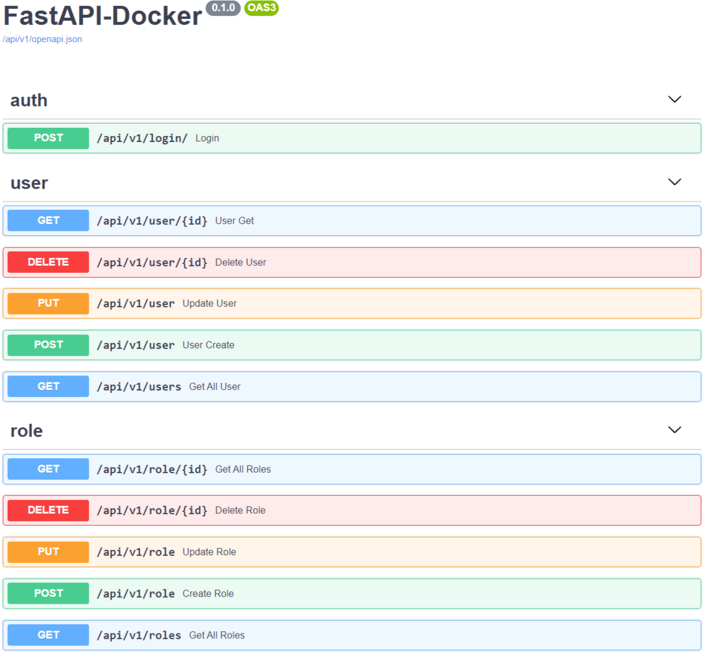

# [FastAPI Docker :rocket:](https://github.com/JeremyAndress/fastapi-docker)

 [](LICENSE)
[](https://github.com/JeremyAndress)

## Features :sparkles:
- [FastAPI](https://fastapi.tiangolo.com/) framework.
- Interactive API documentation
- Full Docker integration.
- Docker Compose integration.
- Production ready Python web server using Uvicorn.
- Secure password hashing by default.
- JWT token authentication.
- SQLAlchemy models
- CORS (Cross Origin Resource Sharing).
- Small utility to paginate SqlAlchemy queries.

## Requirements :pushpin:
- Docker :whale:
- docker-compose :whale:
- Python 3.6+ :snake: **To use without docker**

## Quick Start :seedling:

### Run FastAPI Docker :zap:  Local Development

1. `git clone https://github.com/JeremyAndress/fastapi-docker.git`
2. Create .env files `cp .env.example .env`

> You should now have a directory structure like:

``` sh
.
├── compose
│   ├── local
│   ├── production
│   ├── scripts
│   └── stage
├── nginx
│   └── site.conf
├── requirements
│   ├── local.txt
│   ├── migrations.txt
│   ├── mysql.txt
│   ├── postgre.txt
│   ├── production.txt
│   └── test.txt
├── screenshots
│   └── ui.png
├── src
│   ├── alembic
│   ├── api
│   ├── core
│   ├── db
│   ├── logs
│   ├── models
│   ├── __pycache__
│   ├── schemas
│   ├── tests
│   ├── utils
│   ├── alembic.ini
│   ├── main.py
│   ├── pre_start.py
│   └── prestart.sh
├── CHANGELOG.md
├── LICENSE
├── .env.example
├── .flake8
├── local.yml
├── production.yml
├── pytest.ini
├── README.md
└── stage.yml

```
3. `docker-compose -f local.yml build`
4. `docker-compose -f local.yml up -d`
5. That's just all, api server is listen at http://localhost:8030/docs now

You will see the automatic interactive API documentation (provided by Swagger UI):


## Testing  :rotating_light:

```python
    pytest -vvs src/tests/
```